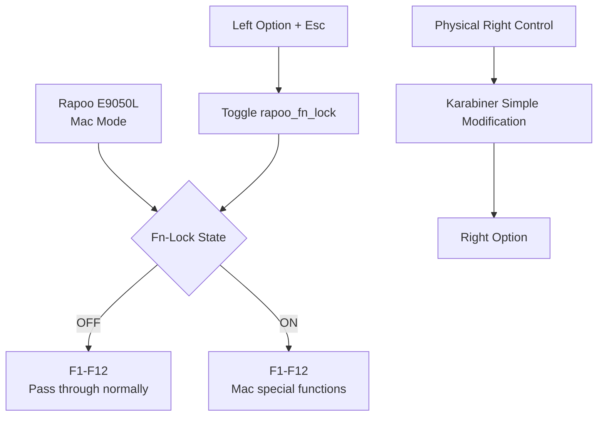
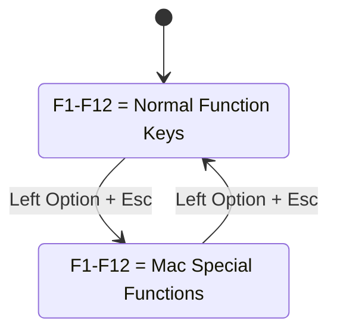
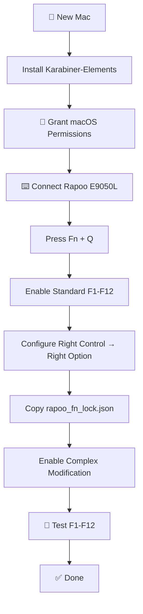

# ⌨️ Rapoo E9050L — macOS Fn-Lock Setup

> A reusable setup guide for configuring the **Rapoo E9050L** on macOS to behave like a keyboard with a proper **Fn-Lock** feature using **Karabiner-Elements**.

---

## 🎯 What This Setup Provides

The Rapoo E9050L has an `Fn` key but **does not have a hardware Fn-Lock key/function**.

This configuration adds a software-based Fn-Lock using Karabiner-Elements.

### Final behaviour

| Mode               | F1–F12 behaviour                  |
| ------------------ | --------------------------------- |
| 🔵 **Fn-Lock OFF** | Normal `F1`–`F12` keys            |
| 🟢 **Fn-Lock ON**  | macOS multimedia/system functions |
| 🔄 **Toggle**      | `Left Option + Esc`               |

Additionally:

> **Physical Right Control → Right Option**

This provides a physical Right Option key for normal macOS/coding workflows.

---

## 🧠 Architecture

The physical `Fn` key on the Rapoo is handled internally by the keyboard firmware.

Karabiner-Elements **does not see the physical Fn key**.

Therefore, we don't try to intercept:

```text
Fn + Esc
```

Instead, Karabiner maintains its own software state.



---

# 📋 Requirements

* 🍎 macOS
* ⌨️ Rapoo E9050L
* 🛠️ Karabiner-Elements
* 🔌 Rapoo E9050L connected via Bluetooth/receiver
* Keyboard configured in **Mac mode**

---

# 1️⃣ Install Karabiner-Elements

Install Karabiner-Elements:

https://karabiner-elements.pqrs.org/

After installation, macOS may ask for permissions.

Go to:

**System Settings → Privacy & Security**

Allow the permissions requested by Karabiner-Elements.

Then open:

**Karabiner-Elements**

---

# 2️⃣ Put the Rapoo E9050L in Mac Mode

The E9050L supports different keyboard modes.

For macOS, use:

```text
Fn + Q
```

### ✅ Verify

The keyboard should now operate in **Mac mode**.

Do **not** use `Fn + W` for this configuration.

---

# 3️⃣ Verify the Keyboard in Karabiner

Open:

**Karabiner-Elements → Devices**

Find the:

```text
Rapoo E9050L
```

Make sure the device is enabled.

---

# 4️⃣ Enable Standard Function Keys in macOS

Go to:

**System Settings → Keyboard → Keyboard Shortcuts → Function Keys**

Enable:

> **Use F1, F2, etc. keys as standard function keys**

This ensures that when Fn-Lock is OFF, the F1–F12 keys behave as normal function keys.

### Expected result

```text
F1  → F1
F2  → F2
F3  → F3
...
F12 → F12
```

---

# 5️⃣ Configure Right Control → Right Option

The E9050L layout does not provide a convenient physical Right Option key for this workflow.

We use the physical:

```text
Right Control
```

as:

```text
Right Option
```

## Steps

Open:

**Karabiner-Elements → Simple Modifications**

Select the **Rapoo E9050L** device.

Add:

| From            | To             |
| --------------- | -------------- |
| `right_control` | `right_option` |

### Result


The Right Control key is now available as a normal **Right Option** key.

### Important

This is completely independent of Fn-Lock.

Therefore:

```text
Right Control
      ↓
Right Option
```

works normally.

It does **not** toggle Fn-Lock.

---

# 6️⃣ Create the Fn-Lock Configuration

Karabiner stores custom complex modifications under:

```text
~/.config/karabiner/assets/complex_modifications/
```

Open the directory:

### Finder

Press:

```text
⌘ + Shift + G
```

Enter:

```text
~/.config/karabiner/assets/complex_modifications/
```

If the directory doesn't exist, create it.

---

# 7️⃣ Create the Configuration File

Create:

```text
rapoo_fn_lock.json
```

The final directory should look like:

```text
~/.config/
└── karabiner/
    └── assets/
        └── complex_modifications/
            └── rapoo_fn_lock.json
```

---

# 8️⃣ Add the Fn-Lock Configuration

Paste the following into:

```text
rapoo_fn_lock.json
```

```json
{
  "title": "Rapoo E9050L Fn Lock",
  "rules": [
    {
      "description": "Rapoo E9050L - Left Option + Esc toggles Fn Lock",
      "manipulators": [
        {
          "type": "basic",
          "from": {
            "key_code": "escape",
            "modifiers": {
              "mandatory": ["left_option"]
            }
          },
          "to": [
            {
              "set_variable": {
                "name": "rapoo_fn_lock",
                "value": 1
              }
            }
          ],
          "conditions": [
            {
              "type": "variable_if",
              "name": "rapoo_fn_lock",
              "value": 0
            }
          ]
        },

        {
          "type": "basic",
          "from": {
            "key_code": "escape",
            "modifiers": {
              "mandatory": ["left_option"]
            }
          },
          "to": [
            {
              "set_variable": {
                "name": "rapoo_fn_lock",
                "value": 0
              }
            }
          ],
          "conditions": [
            {
              "type": "variable_if",
              "name": "rapoo_fn_lock",
              "value": 1
            }
          ]
        },

        {
          "type": "basic",
          "from": {
            "key_code": "f1"
          },
          "to": [
            {
              "apple_vendor_keyboard_key_code": "brightness_down"
            }
          ],
          "conditions": [
            {
              "type": "variable_if",
              "name": "rapoo_fn_lock",
              "value": 1
            }
          ]
        },

        {
          "type": "basic",
          "from": {
            "key_code": "f2"
          },
          "to": [
            {
              "apple_vendor_keyboard_key_code": "brightness_up"
            }
          ],
          "conditions": [
            {
              "type": "variable_if",
              "name": "rapoo_fn_lock",
              "value": 1
            }
          ]
        },

        {
          "type": "basic",
          "from": {
            "key_code": "f3"
          },
          "to": [
            {
              "apple_vendor_keyboard_key_code": "mission_control"
            },
            {
              "key_code": "vk_none"
            }
          ],
          "conditions": [
            {
              "type": "variable_if",
              "name": "rapoo_fn_lock",
              "value": 1
            }
          ]
        },

        {
          "type": "basic",
          "from": {
            "key_code": "f4"
          },
          "to": [
            {
              "consumer_key_code": "al_email_reader"
            }
          ],
          "conditions": [
            {
              "type": "variable_if",
              "name": "rapoo_fn_lock",
              "value": 1
            }
          ]
        },

        {
          "type": "basic",
          "from": {
            "key_code": "f5"
          },
          "to": [
            {
              "consumer_key_code": "al_consumer_control_configuration"
            }
          ],
          "conditions": [
            {
              "type": "variable_if",
              "name": "rapoo_fn_lock",
              "value": 1
            }
          ]
        },

        {
          "type": "basic",
          "from": {
            "key_code": "f6"
          },
          "to": [
            {
              "consumer_key_code": "play_or_pause"
            }
          ],
          "conditions": [
            {
              "type": "variable_if",
              "name": "rapoo_fn_lock",
              "value": 1
            }
          ]
        },

        {
          "type": "basic",
          "from": {
            "key_code": "f7"
          },
          "to": [
            {
              "consumer_key_code": "stop"
            }
          ],
          "conditions": [
            {
              "type": "variable_if",
              "name": "rapoo_fn_lock",
              "value": 1
            }
          ]
        },

        {
          "type": "basic",
          "from": {
            "key_code": "f8"
          },
          "to": [
            {
              "consumer_key_code": "scan_previous_track"
            }
          ],
          "conditions": [
            {
              "type": "variable_if",
              "name": "rapoo_fn_lock",
              "value": 1
            }
          ]
        },

        {
          "type": "basic",
          "from": {
            "key_code": "f9"
          },
          "to": [
            {
              "consumer_key_code": "scan_next_track"
            }
          ],
          "conditions": [
            {
              "type": "variable_if",
              "name": "rapoo_fn_lock",
              "value": 1
            }
          ]
        },

        {
          "type": "basic",
          "from": {
            "key_code": "f10"
          },
          "to": [
            {
              "consumer_key_code": "volume_decrement"
            }
          ],
          "conditions": [
            {
              "type": "variable_if",
              "name": "rapoo_fn_lock",
              "value": 1
            }
          ]
        },

        {
          "type": "basic",
          "from": {
            "key_code": "f11"
          },
          "to": [
            {
              "consumer_key_code": "volume_increment"
            }
          ],
          "conditions": [
            {
              "type": "variable_if",
              "name": "rapoo_fn_lock",
              "value": 1
            }
          ]
        },

        {
          "type": "basic",
          "from": {
            "key_code": "f12"
          },
          "to": [
            {
              "consumer_key_code": "mute"
            }
          ],
          "conditions": [
            {
              "type": "variable_if",
              "name": "rapoo_fn_lock",
              "value": 1
            }
          ]
        }
      ]
    }
  ]
}
```

---

# 9️⃣ Enable the Complex Modification

Open:

**Karabiner-Elements → Complex Modifications**

Find:

```text
Rapoo E9050L - Left Option + Esc toggles Fn Lock
```

Click:

**Enable**

---

# 🔄 How Fn-Lock Works

Karabiner maintains a variable:

```text
rapoo_fn_lock
```

It has two states:

```text
0 = OFF
1 = ON
```

The toggle works like this:



---

# 🔵 Fn-Lock OFF

This is the default state.

```text
F1  → F1
F2  → F2
F3  → F3
F4  → F4
F5  → F5
F6  → F6
F7  → F7
F8  → F8
F9  → F9
F10 → F10
F11 → F11
F12 → F12
```

Useful for:

* 👨‍💻 Coding
* 🖥️ Development tools
* 🐛 Debugging
* 🧑‍💻 IntelliJ
* 💻 Terminal
* 🎯 IDE shortcuts
* ⌨️ Keyboard shortcuts involving F-keys

---

# 🟢 Fn-Lock ON

Press:

```text
Left Option + Esc
```

The F-keys now behave like the Mac special-function row.

| Key | Action             |
| --- | ------------------ |
| F1  | 🔅 Brightness Down |
| F2  | 🔆 Brightness Up   |
| F3  | 🪟 Mission Control |
| F4  | ✉️ Mail            |
| F5  | 🎵 Music / Player  |
| F6  | ▶️ Play / Pause    |
| F7  | ⏹️ Stop            |
| F8  | ⏮️ Previous Track  |
| F9  | ⏭️ Next Track      |
| F10 | 🔉 Volume Down     |
| F11 | 🔊 Volume Up       |
| F12 | 🔇 Mute            |

---

# 🔄 Toggle Fn-Lock

### Turn ON

```text
Left Option + Esc
```

```text
F1 → Brightness ↓
F2 → Brightness ↑
...
F12 → Mute
```

### Turn OFF

Press again:

```text
Left Option + Esc
```

```text
F1 → F1
F2 → F2
...
F12 → F12
```

---

# 🧪 Verification Checklist

After installing on a new Mac, verify these in order.

## Keyboard

* [ ] Rapoo E9050L connected
* [ ] Keyboard is in Mac mode using `Fn + Q`
* [ ] Keyboard appears in Karabiner-Elements

## macOS

* [ ] **Use F1, F2, etc. keys as standard function keys** enabled

## Right Option

* [ ] Physical Right Control behaves as Right Option
* [ ] Right Control can be used for normal Option shortcuts

## Fn-Lock OFF

* [ ] F1 sends F1
* [ ] F2 sends F2
* [ ] F3 sends F3
* [ ] F4 sends F4
* [ ] F5 sends F5
* [ ] F6 sends F6
* [ ] F7 sends F7
* [ ] F8 sends F8
* [ ] F9 sends F9
* [ ] F10 sends F10
* [ ] F11 sends F11
* [ ] F12 sends F12

## Fn-Lock ON

Press:

```text
Left Option + Esc
```

Then verify:

* [ ] F1 → Brightness Down
* [ ] F2 → Brightness Up
* [ ] F3 → Mission Control
* [ ] F4 → Mail
* [ ] F5 → Music
* [ ] F6 → Play/Pause
* [ ] F7 → Stop
* [ ] F8 → Previous Track
* [ ] F9 → Next Track
* [ ] F10 → Volume Down
* [ ] F11 → Volume Up
* [ ] F12 → Mute

## Toggle back

* [ ] Press `Left Option + Esc`
* [ ] F1–F12 return to normal function-key behaviour

---

# 🔍 Troubleshooting

## Problem: Fn-Lock doesn't toggle

Open:

**Karabiner-Elements → EventViewer**

Check that:

```text
Left Option + Esc
```

is detected.

The variable should switch between:

```text
rapoo_fn_lock = 0
```

and:

```text
rapoo_fn_lock = 1
```

---

## Problem: F1–F12 don't behave as normal F-keys

Check:

**System Settings → Keyboard → Keyboard Shortcuts → Function Keys**

Make sure:

> **Use F1, F2, etc. keys as standard function keys**

is enabled.

---

## Problem: Right Control doesn't work as Right Option

Open:

**Karabiner-Elements → Simple Modifications**

Verify:

```text
right_control → right_option
```

is configured for the **Rapoo E9050L**.

---

## Problem: Fn key isn't visible in EventViewer

This is **expected**.

The E9050L handles Fn internally.

You should **not** expect to see:

```text
fn
```

in Karabiner EventViewer.

The software Fn-Lock implementation deliberately avoids depending on the physical Fn key.

---

# 💾 Recommended Git Repository Structure

For maintaining this configuration over time, a simple structure is enough:

```text
rapoo-e9050l-macos/
│
├── README.md
│
└── karabiner/
    └── rapoo_fn_lock.json
```

The JSON file can be copied directly to:

```text
~/.config/karabiner/assets/complex_modifications/
```

---

# 🚀 Quick Setup for a New Mac

Once you're familiar with the setup, the entire process is:



### Fast command-line copy

If this repository is cloned locally:

```bash
mkdir -p ~/.config/karabiner/assets/complex_modifications

cp karabiner/rapoo_fn_lock.json \
  ~/.config/karabiner/assets/complex_modifications/
```

Then open Karabiner-Elements and enable the rule.

---

# 📝 Important Notes

### 1. Keep the keyboard in Mac mode

```text
Fn + Q
```

This configuration is designed around the **Mac mode** of the E9050L.

### 2. Don't modify the physical Fn key

Karabiner cannot see the E9050L's physical Fn key. This is expected.

### 3. Left Option is the Fn-Lock toggle

```text
Left Option + Esc
```

Do not change this to Right Option unless intentionally modifying the configuration.

### 4. Right Control is Right Option

```text
Right Control → Right Option
```

This is a separate Simple Modification and does not participate in Fn-Lock.

### 5. Fn-Lock state

The state is maintained by Karabiner as:

```text
rapoo_fn_lock
```

If Karabiner is restarted, the variable may return to its default/unset state, which behaves as **Fn-Lock OFF**.

---

# 🎉 Final Result

You effectively turn the Rapoo E9050L into a keyboard with a software Fn-Lock:

```text
                     ⌨️ RAPOO E9050L
                           │
                           ▼
                    ┌─────────────┐
                    │  Fn-Lock?   │
                    └──────┬──────┘
                           │
              ┌────────────┴────────────┐
              │                         │
             OFF                       ON
              │                         │
              ▼                         ▼
         F1 → F1                  F1 → Brightness ↓
         F2 → F2                  F2 → Brightness ↑
         F3 → F3                  F3 → Mission Control
         F4 → F4                  F4 → Mail
         F5 → F5                  F5 → Music
         F6 → F6                  F6 → Play/Pause
         F7 → F7                  F7 → Stop
         F8 → F8                  F8 → Previous
         F9 → F9                  F9 → Next
         F10 → F10                F10 → Volume ↓
         F11 → F11                F11 → Volume ↑
         F12 → F12                F12 → Mute
              ▲                         │
              │                         │
              └──── Left Option + Esc ──┘


        Physical Right Control
                  │
                  ▼
             Right Option
                  │
                  ▼
        Normal coding/macOS use
```

## ⭐ Shortcut to remember

> **⌨️ Left Option + Esc = Fn-Lock ON/OFF**

> **⌨️ Right Control = Right Option**

That's the complete setup for reproducing this configuration on another Mac.
